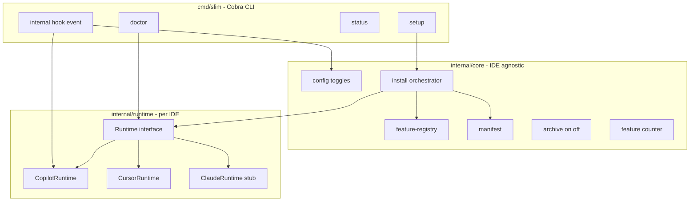
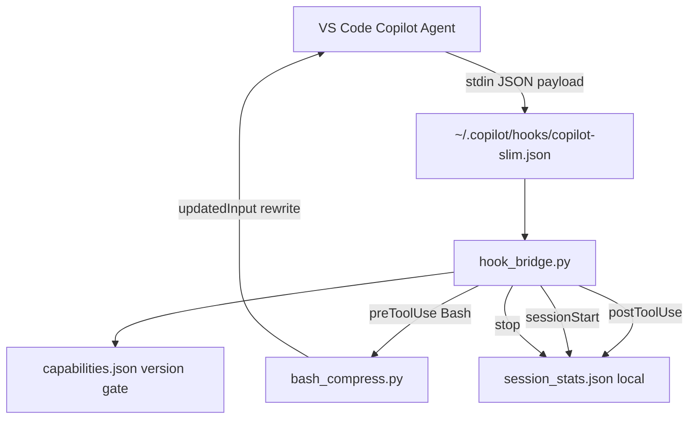
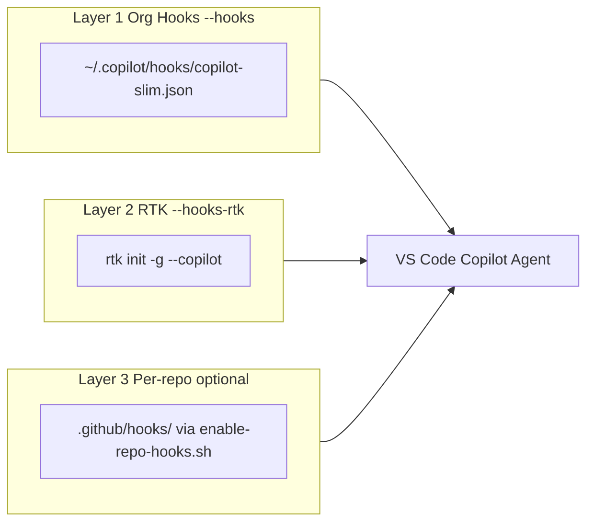
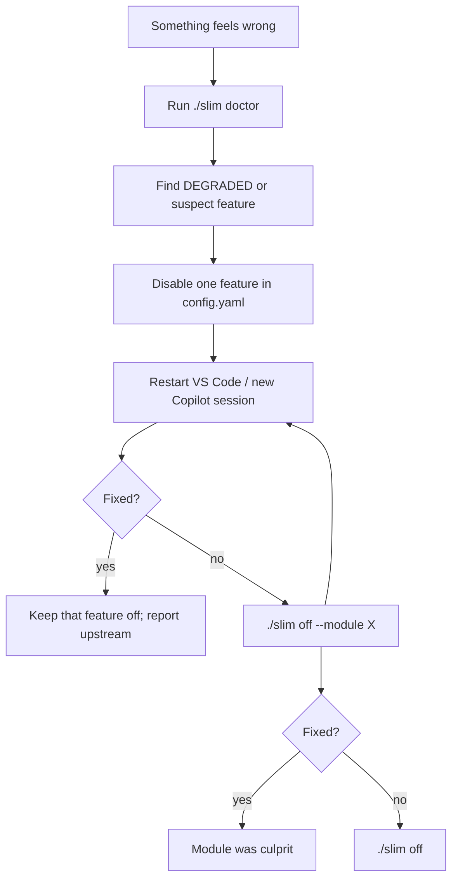
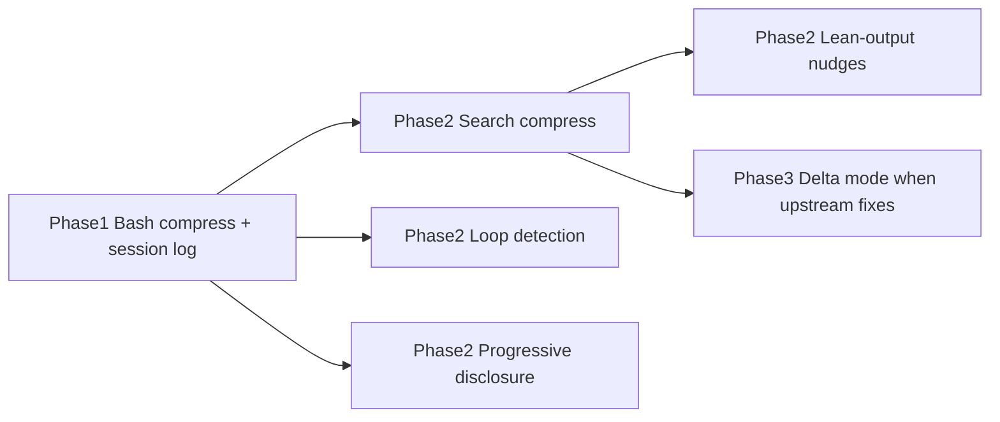

# Copilot Slim — Bootstrap Plan

**Product name:** Copilot Slim  
**CLI entry point:** `slim` (Go binary — `go build` or released artifact)  
**Data home:** `~/.copilot/slim/` (Copilot target; each runtime has its own home)  
**Repo folder:** `token-optimizer`

## Architecture: Go + runtime adapters (IDE-agnostic core)

**Yes — use Go for the CLI and shared core**, not shell. Shell is OS-friction (path detection, JSON merge, Windows). Go gives one cross-compiled binary (darwin/linux/windows) and clean interfaces for adding IDE targets later.



### `Runtime` interface (Go — your "base class")

All IDE-specific behavior lives behind one interface. **Core never imports Copilot/Cursor paths directly.**

```go
// internal/runtime/runtime.go
type Runtime interface {
    ID() string                    // "copilot" | "cursor" | "claude"
    DisplayName() string           // "GitHub Copilot (VS Code)"
    DataHome() (string, error)     // e.g. ~/.copilot/slim

    // Lifecycle
    Setup(ctx context.Context, modules []string, dryRun bool) (*SetupResult, error)
    Off(ctx context.Context, modules []string) (*OffResult, error)

    // Diagnostics
    Status(ctx context.Context) (*StatusReport, error)
    Doctor(ctx context.Context, opts DoctorOpts) (*DoctorReport, error)
    Probe(ctx context.Context) (*ProbeReport, error)

    // Hooks (runtime invokes: slim internal hook <event>)
    HookCommand(event string) []string
    WriteHookRegistration(ctx context.Context) error
    RemoveHookRegistration(ctx context.Context) error
}
```

**`internal/core`** (shared, IDE-agnostic):
- Load `feature-registry.yaml` (embedded)
- Manifest read/write, idempotent orchestration
- Config toggles (`config.yaml`)
- Archive on `off`
- Feature counting: `N/M modules`, `N/M features`
- Logging layout under `runtime.DataHome()`

**`internal/runtime/copilot`** (Phase 1 — only full implementation):
- Paths: `~/.copilot/hooks/`, `~/.copilot/skills/`, VS Code `settings.json` per OS
- Hook JSON schema for Copilot
- `slim internal hook pre-tool-use` etc. (bash compression, session log)
- Capability probe for Copilot extension version

**`internal/runtime/cursor`**, **`internal/runtime/claude`** (Phase 3 stubs):
- Implement interface with `ErrNotImplemented` or no-op
- `slim setup --target cursor` prints "not yet available; see docs/cursor-manual.md"
- Lets you add IDE features incrementally without rewriting core

### Why Go for hooks too (not a separate Python bridge)

Copilot hook JSON points at the **same binary**:

```json
{ "type": "command", "bash": "slim internal hook pre-tool-use", "timeoutSec": 10 }
```

Installed copy: `~/.copilot/slim/bin/slim` (symlink or copy from build). One artifact for CLI + hook bridge — no Python dependency.

### OS agnosticism

| Concern | Go approach |
|---------|-------------|
| Paths | `os.UserHomeDir()`, `runtime.GOOS` for VS Code settings dir |
| Windows | Cross-compile `slim-windows-amd64.exe`; same commands |
| Templates | `//go:embed templates/...` — no path-to-repo dependency after install |
| JSON/settings merge | `encoding/json` with manifest-backed revert |
| SQLite (Phase 2) | `modernc.org/sqlite` or `database/sql` — pure Go |

### Developer workflow (clone repo)

```bash
git clone <org>/token-optimizer && cd token-optimizer
make build                    # → bin/slim
./bin/slim setup --target copilot --all
# or: go run ./cmd/slim setup --all
```

**Releases:** GitHub Actions builds darwin/linux/windows binaries; optional thin `install.sh` downloads the right artifact (bootstrap only — not the main CLI logic).

### CLI target flag

```bash
slim setup --target copilot    # default, full implementation
slim setup --target cursor     # Phase 3
slim doctor --target copilot
slim status                    # shows active target + counts for that runtime
```

`feature-registry.yaml` gains per-target metadata:

```yaml
features:
  bash_compress:
    label: "Bash output compression"
    targets: [copilot, cursor, claude]   # planned support
    phase: 1
    implemented: [copilot]               # doctor uses this
```

---

## Goal

Turn [token-optimizer](file:///Users/sheshisheri/Documents/ai-agents/token-optimizer) into **Copilot Slim** — a Go CLI with shared core and pluggable IDE runtimes:

1. `make build && ./bin/slim setup --target copilot`
2. Phase 1: full **CopilotRuntime** only; Cursor/Claude adapters stubbed
3. `./bin/slim status` / `doctor` show **N/M modules and features** for the active target
4. `./bin/slim off` archives cleanly; per-feature toggles via `config.yaml`
5. Tomorrow: implement `CursorRuntime` without touching manifest/registry/archive core

---

## Scope: Generic practices vs IDE-specific wiring

**Short answer:** The *ideas* are mostly generic; the *installer* is **GitHub Copilot + VS Code only** for Phase 1. Same repo can grow other targets later, but paths, hook formats, and config files differ per tool.

### What is generic (works across Copilot, Cursor, Claude Code, etc.)

These are **practices and content patterns** — not tied to one IDE. Ship as docs + repo templates; any developer can apply manually:

| Practice | Applies to |
|----------|------------|
| Compressed instructions ("code only", caveman-speak) | Any agent with custom instructions |
| `applyTo:` / scoped context (only load rules when relevant) | Copilot, Cursor rules with globs |
| MCP vs Skills (lazy vs eager context) | Copilot, Cursor, Claude Code agents |
| Ask/plan-first vs Agent mode | Any chat/agent IDE |
| Cache stability (don't switch model/tools mid-thread) | Any billed agent session |
| Close unused tabs / small focused files | VS Code, Cursor, JetBrains |
| MarkItDown before feeding docx/pdf to AI | Tool-agnostic |
| Terse issues/PRs, `copilot-setup-steps.yml` pattern | GitHub Coding Agent / similar |
| Bash output compression **concept** | Any agent that runs shell commands |

`docs/practices.md` and `templates/repo/` are **IDE-agnostic** — teams copy into whichever stack they use.

### What is IDE / product-specific (must be wired per target)

Slim Phase 1 **only automates** the GitHub Copilot + VS Code column:

| Capability | GitHub Copilot (VS Code) | Cursor | Claude Code CLI |
|------------|--------------------------|--------|-----------------|
| Hook install path | `~/.copilot/hooks/copilot-slim.json` | `~/.cursor/hooks.json` | `~/.claude/settings.json` hooks |
| Skills / instructions | `~/.copilot/skills/` | `~/.cursor/skills/` or rules | `~/.claude/skills/`, `CLAUDE.md` |
| IDE settings merge | `Code/User/settings.json` (`github.copilot.*`) | `Cursor/User/settings.json` | N/A (CLI) |
| RTK global hook | `rtk init -g --copilot` | `rtk init -g --agent cursor` | `rtk init -g` |
| Token/cost readout | VS Code debug logs / Copilot nanoAIU | Cursor usage (different APIs) | `~/.claude/` session state |
| alexgreensh adapter | `install.sh --copilot` | N/A (uses Claude plugin) | Native plugin |

**Hooks are not interchangeable.** Copilot, Cursor, and Claude Code each have their own hook JSON schema, event names, and payload shapes. One `hook_bridge.py` cannot serve all three without a **runtime adapter per target** (alexgreensh ships separate adapters for Copilot, Claude, Hermes, etc.).

### Phase 1 decision (unchanged)

```
./slim setup   →   targets: VS Code + GitHub Copilot only
                   data home: ~/.copilot/slim/
                   does NOT touch: ~/.cursor/, ~/.claude/
```

Developers on Cursor or Claude Code in your org still benefit from:
- `docs/practices.md` (generic habits)
- `templates/repo/` (copilot-instructions, `.copilotignore` — adapt filenames for their tool)
- Optional manual RTK: `rtk init -g --agent cursor` or `rtk init -g` for Claude

### Future extensibility (not Phase 1)

Add new IDE by implementing `Runtime` in `internal/runtime/<name>/` — **no changes to core orchestrator**:

```bash
slim setup --target copilot    # CopilotRuntime — Phase 1
slim setup --target cursor     # CursorRuntime — Phase 3
slim setup --target claude     # ClaudeRuntime — Phase 3
```

Shared hook **logic** (bash compression algorithms) can live in `internal/hook/compress/`; each runtime only differs in **how output is injected** (Copilot `updatedInput` vs Cursor hook schema vs Claude `PreToolUse`).

**Recommendation:** Go + `Runtime` interface from day one; ship Copilot adapter only in MVP.

---

## Copilot Slim CLI

Single branded entry point. Every subcommand prints a **feature tally** footer when relevant.

```bash
./slim help                    # full command map + where logs live
./slim setup                   # interactive module picker
./slim setup --all             # hooks + skills + settings + vscode
./slim setup --module hooks    # one module only
./slim setup --dry-run         # preview, no writes

./slim status                  # modules installed, features active (counts)
./slim doctor                  # health probe + per-feature OK/DEGRADED/OFF/BLOCKED
./slim doctor --probe          # re-check after Copilot update
./slim doctor --audit          # MCP/skill/instruction bloat scan
./slim doctor --json           # machine-readable

./slim report                  # savings summary (today)
./slim report --days 30        # monthly rollup (Phase 2)

./slim config list             # all features + current on/off
./slim config set bash_compress off   # disable one feature
./slim config get lean_output_nudges

./slim logs                    # show log file paths + last 20 hook lines
./slim logs --tail 50          # tail hook log
./slim logs --sessions         # list recent session summaries

./slim off                     # archive everything
./slim off --module hooks      # disable one module
./slim off --feature bash_compress  # alias for config set off + persist
```

### Feature registry (extensible catalog)

New features added tomorrow auto-appear in counts because they register in `templates/feature-registry.yaml`:

```yaml
# templates/feature-registry.yaml — single source of truth
version: 1
modules:
  hooks:
    label: "Hook engine"
    features:
      bash_compress:      { label: "Bash output compression", phase: 1 }
      search_compress:    { label: "Search/grep compression", phase: 2 }
      lean_output_nudges: { label: "Lean output nudges", phase: 2 }
      session_continuity: { label: "Session continuity", phase: 1 }
      session_logging:    { label: "Session logging", phase: 1 }
      loop_detection:     { label: "Loop detection", phase: 2 }
  skills:
    label: "Compressed skills"
    features:
      output-control:   { label: "Output control skill", phase: 1 }
      token-economy:    { label: "Token economy skill", phase: 1 }
      mcp-hygiene:      { label: "MCP hygiene skill", phase: 1 }
      workflow-habits:  { label: "Workflow habits skill", phase: 1 }
  # ... vscode, measurement, hooks-rtk modules
```

On `setup`, `status`, and `doctor`, Slim reads registry + manifest + config and prints:

```
Copilot Slim v1.0.0
─────────────────────
Modules:  4/6 installed   (hooks, skills, settings, vscode)
Features: 5/10 active    (3 OFF by choice, 2 not yet shipped, 0 DEGRADED)

Run ./slim doctor for details  |  ./slim help for all commands
```

When new Phase 2 features ship, bump registry → counts update automatically (e.g. `5/10` → `6/10` after user enables `search_compress`).

### Where to run commands

| Where | Command | Notes |
|-------|---------|-------|
| **From cloned repo** | `./slim <cmd>` | Primary — always use latest scripts from repo |
| **After setup (optional)** | `~/.copilot/slim/bin/slim <cmd>` | Symlink installed on `setup --all` for use outside repo dir |
| **Deprecated alias** | `./install.sh` | Prints deprecation notice → delegates to `./slim setup` |

### Where logs and reports live

Documented in `./slim help` and [docs/commands.md](docs/commands.md):

| Path | Contents |
|------|----------|
| `~/.copilot/slim/manifest.json` | Install ledger — modules, features, versions, settings backups |
| `~/.copilot/slim/config.yaml` | Runtime feature toggles (on/off without reinstall) |
| `~/.copilot/slim/capabilities.json` | Per-Copilot-version probe matrix |
| `~/.copilot/slim/last-probe.json` | Timestamped result of last `slim doctor --probe` |
| `~/.copilot/slim/logs/hook.log` | Hook bridge activity (compressions, skips, errors) |
| `~/.copilot/slim/sessions/*.json` | Per-session summaries from `stop` hook |
| `~/.copilot/slim/trends.db` | SQLite rollup for `slim report` (Phase 2) |
| `~/.copilot/slim-archive/<timestamp>/` | Archived files after `slim off` |
| `~/.copilot/hooks/copilot-slim.json` | Hook registration (Copilot reads this) |

```bash
./slim logs              # prints all paths above + tails hook.log
./slim report            # human-readable savings from sessions/ + trends.db
./slim doctor --json     # full status export for support tickets
```

---

## Why Hooks Are the Centerpiece

The referenced repos agree: **the biggest token waste is not the prompt you type — it's what Copilot silently pulls in** (bash output, tool schemas, always-on instructions, session replay). Hooks are the only mechanism that intercepts that payload **before** it hits the model.

| Source | Hook approach | What it saves |
|--------|---------------|---------------|
| [alexgreensh/token-optimizer](https://github.com/alexgreensh/token-optimizer) | `~/.copilot/hooks/token-optimizer.json` — preToolUse bash rewrite, postToolUse nudges, sessionStart continuity, stop rollup | 40–70% on verbose command output; session cost tracking |
| [olivomarco guide §2.7.7](https://github.com/olivomarco/github-copilot-token-optimization/blob/main/docs/08-mcp-tool-costs.md) | RTK PreToolUse hook — rewrites `git status` → `rtk git status` etc. | 60–90% on bash tool output |
| [RTK supported agents](https://github.com/rtk-ai/rtk) | `rtk init -g --copilot` — **global** VS Code Copilot hook | Same, user-global (not per-repo) |

**Plan decision:** Hooks are a **first-class install module** (`--hooks`), not a Phase 2 afterthought. Skills and settings reduce always-on input; hooks reduce the dynamic per-step bloat that skills cannot touch.

---

## Hook Architecture (org custom build)



### Install targets (user-global)

| Path | Purpose |
|------|---------|
| `~/.copilot/hooks/copilot-slim.json` | Hook registration (only our file — never overwrite other hooks) |
| `~/.copilot/slim/plugin/` | Bridge + compress scripts (stable path, survives repo moves) |
| `~/.copilot/slim/capabilities.json` | Per-Copilot-version feature gates |
| `~/.copilot/slim/manifest.json` | Install ledger + feature registry sync |

### Hook events to implement (MVP)

Modeled on alexgreensh's Copilot adapter (`copilot_install.py`):

| Event | Matcher | Action | Token impact |
|-------|---------|--------|--------------|
| `preToolUse` | `bash` | Rewrite safe read-only commands through `bash_compress.py` via `updatedInput` | **Highest** — trims `git log`, `pytest`, `cargo test` output |
| `postToolUse` | all | Track cumulative tool-output size; inject nudge when context grows large | Medium — prevents runaway sessions |
| `sessionStart` | — | Inject terse output reminder + restore session continuity checkpoint | Medium |
| `stop` | — | Write session summary to local `~/.copilot/slim/sessions/` | Enables ROI measurement |

**Deferred (Phase 2)** — upstream Copilot hook fields are broken/regressed on some versions:
- `preToolUse additionalContext` (read interception / delta mode) — blocked upstream
- `userPromptSubmitted` context injection — regressed in recent CLI releases
- Full HTML dashboard — build lightweight JSON summary first

### Safety constraints (from alexgreensh HOOKS.md)

- Hooks **fail open** — never block a tool call on error
- Bash rewrite uses **whitelist + dangerous-char exclusion** (`;|&$()` etc.)
- No network calls, no writes outside `~/.copilot/slim/`
- 10s timeout per hook invocation
- Capability map gates features per installed Copilot version; doctor reports what actually works

---

## Three Hook Layers (opt-in independently)



| Module flag | What it does | Opt-out |
|-------------|--------------|---------|
| `--hooks` | Install org hook engine to `~/.copilot/hooks/` | Archive hook JSON + plugin dir |
| `--hooks-rtk` | Install `rtk` binary + `rtk init -g --copilot` | `rtk init -g --uninstall` (tracked in manifest) |
| `--hooks-repo` | Copy hook template into **current repo** only (explicit, never default) | Remove `.github/hooks/copilot-slim.json` from that repo |

**Default for `./slim setup --all`:** hooks + skills + settings + vscode. RTK is **off by default**.

---

## Full Module List

| Module | `slim setup` flag | Token impact |
|--------|-------------------|--------------|
| hooks | `--module hooks` | **Highest** |
| hooks-rtk | `--module hooks-rtk` | **Highest** (optional external) |
| skills | `--module skills` | High |
| settings | `--module settings` | Medium |
| vscode | `--module vscode` | Medium |
| measurement | `--module measurement` | ROI proof (privacy warning) |

```bash
./slim setup --all
./slim setup --module hooks --module skills
./slim setup --dry-run
./slim off
./slim off --module hooks
./slim status                   # always shows module + feature counts
```

---

## Proposed Repository Layout

```
token-optimizer/
├── cmd/slim/main.go
├── internal/
│   ├── core/                     # manifest, registry, config, archive — IDE agnostic
│   ├── runtime/
│   │   ├── runtime.go            # Runtime interface
│   │   ├── copilot/              # Phase 1
│   │   ├── cursor/               # stub
│   │   └── claude/               # stub
│   └── hook/                     # shared bash compression logic
├── templates/                    # go:embed
├── Makefile
├── go.mod
├── install.sh                    # optional: download release binary
└── docs/architecture.md
```

Installed (Copilot target): `~/.copilot/slim/bin/slim` + `~/.copilot/hooks/copilot-slim.json`

---

## Idempotent Install Behavior

Install must be safe to run repeatedly without breaking or duplicating state. Documented guarantees:

| Scenario | Expected behavior |
|----------|-------------------|
| **First install** | `core.Orchestrator` + `CopilotRuntime.Setup`: copy binary, write hook JSON, merge settings, write manifest |
| **Re-run `./slim setup --all`** | Refresh plugin files in place, rewrite hook JSON (same path), merge settings idempotently (skip if values match), update `manifest.json` timestamps + version — **no duplicate files, no stacked hooks** |
| **Re-run single module** `./slim setup --module hooks` | Update only hooks module; other modules untouched |
| **Install after partial `--off`** | Re-enable archived module from templates; restore from archive if user chooses `--restore`, else fresh copy |
| **Clone moved / repo path changed** | Binary at `~/.copilot/slim/bin/slim` — hooks still work; manifest stores install version only |
| **Copilot version changed** | `capabilities.json` re-seeded on install; doctor re-probes which hook fields work |
| **`--dry-run`** | Print every file write, settings key, and manifest change without touching disk |

**Implementation rules:**
- Write **only our hook file** (`copilot-slim.json`) — never merge into or overwrite other vendors' hook JSON
- Settings merge: store previous values in manifest before first write; re-merge only keys we own
- Skills: replace our skill dirs atomically (rm + copy), never append duplicate folders
- Manifest is source of truth for what we installed; uninstall reads manifest only

```bash
./slim setup --all              # idempotent refresh
./slim setup --all --dry-run    # preview changes
./slim status           # show installed modules + versions (no writes)
```

---

## Per-Feature Toggles (turn off without full uninstall)

Developers must be able to **disable individual features** when something misbehaves, without removing the whole toolkit.

### Three levels of opt-out

| Level | Command | Use when |
|-------|---------|----------|
| **1. Runtime toggle** | Edit `~/.copilot/slim/config.yaml` or env var | Suspect one hook feature (e.g. bash compress); instant, no reinstall |
| **2. Module off** | `./slim off --module hooks` | Whole hooks layer broken; keep skills/settings |
| **3. Full off** | `./slim off` | Want everything gone; archives all modules |

### Runtime config (`~/.copilot/slim/config.yaml`)

```yaml
features:
  bash_compress: true        # preToolUse bash rewrite
  search_compress: false     # Phase 2
  lean_output_nudges: true   # postToolUse verbosity steer
  session_continuity: true   # sessionStart checkpoint restore
  loop_detection: false      # Phase 2
  session_logging: true      # stop hook → local stats

modules:
  skills: true
  hooks: true
  hooks_rtk: false
  vscode_settings: true
  measurement: false
```

Equivalent env overrides (for one-shot disable without editing file):

```bash
ORG_SLIM_BASH_COMPRESS=0    # disable bash compression only
ORG_SLIM_LEAN_NUDGES=0      # disable output nudges only
```

Hook bridge reads `config.yaml` on every invocation (lightweight inline read, fail-open). Disabling a feature = hook becomes no-op for that path; **hook file stays registered** so re-enable is flip a bool, not reinstall.

### Per-skill removal

```bash
./slim off --module skills --only output-control   # remove one skill
./slim setup --module skills --only token-economy                 # re-add one skill
```

---

## Diagnostics: What Is Working vs Not

`./slim doctor` is the **primary tool** for developers to understand install health. Every feature reports one of four states:

| Status | Meaning | Developer action |
|--------|---------|------------------|
| **OK** | Installed, probed, working on this Copilot version | None |
| **DEGRADED** | Installed but capability probe failed (upstream hook field broken) | Feature auto-disabled; see hint; optional env override |
| **OFF** | Disabled in config.yaml or module not installed | `./slim setup --module <name>` to enable |
| **BLOCKED** | Not supported on this Copilot version / platform | Wait for upstream fix or use alternative (e.g. RTK) |

### Example doctor output (human-readable)

```
Copilot Slim v1.0.0 — Doctor
────────────────────────────
Modules:  4/6 installed  |  Features: 5/10 active (3 OFF, 0 DEGRADED, 2 not shipped)

MODULES
  hooks          OK       ~/.copilot/hooks/copilot-slim.json
  skills         OK       4 skills installed
  vscode         OK       3 settings keys merged
  hooks-rtk      OFF      not installed
  measurement    OFF      not installed

HOOK FEATURES (probed against Copilot 1.350.0)
  bash_compress       OK       last fired 2m ago, 12 compressions today
  session_continuity  OK
  lean_output_nudges  DEGRADED preToolUse additionalContext broken upstream (#2585) — auto-off
  session_logging     OK       3 sessions logged today

SKILLS
  output-control      OK       ~/.copilot/skills/output-control/
  token-economy       OK
  mcp-hygiene         OK
  workflow-habits     OK

WARNINGS
  ! measurement off — cannot show per-request credit costs
  ! 2 MCP servers enabled — run: doctor --audit for bloat check

Quick fixes:
  Turn off bash compress:  ./slim config set bash_compress off
  Turn off all hooks:      ./slim off --module hooks
  Full status JSON:        ./slim doctor --json
```

### `slim doctor` modes

```bash
./slim doctor              # full status table (default)
./slim doctor --json       # machine-readable for scripts/CI
./slim doctor --probe      # re-run capability probes (after Copilot update)
./slim doctor --audit      # structural waste: MCP count, skill sizes, instruction bloat
./slim doctor --module hooks  # single module deep-dive
```

### Capability probe (how we know what works)

On install and `doctor --probe`, run lightweight checks (alexgreensh `copilot-doctor` pattern):

1. Read installed Copilot / VS Code extension version
2. Compare against `capabilities.json` matrix (seeded + user overrides)
3. For each hook feature, report: supported / degraded / blocked + upstream issue link if known
4. Write probe results to `~/.copilot/slim/last-probe.json` (timestamped)

Hook bridge **gates each feature** on probe result — if `bash_compress` probe fails, bridge skips rewrite (fail-open, transparent to Copilot).

---

## Troubleshooting Workflow (document in docs/troubleshooting.md)

When Copilot behaves oddly after install, developers follow this bisect path:



**Documented bisect order** (most likely culprits first):

1. `bash_compress` — if agent commands return truncated/wrong output
2. `hooks-rtk` — if RTK also installed; try `./slim off --module hooks-rtk` first
3. `lean_output_nudges` — if responses too terse or missing explanations
4. `skills` — if behavior/personality changed globally; try `./slim off --module skills`
5. `vscode` settings — if model or debug behavior changed; try `--off --module vscode`
6. Full `./slim off` — nuclear option; restores pre-install state from manifest

**Recovery:** `./slim restore --from <timestamp>` from archived `~/.copilot/slim-archive/<timestamp>/`.

---

## Manifest (critical for hook opt-out)

`~/.copilot/slim/manifest.json`:

```json
{
  "version": 1,
  "installedAt": "2026-06-24T...",
  "repoVersion": "abc123",
  "repoPath": "/Users/dev/token-optimizer",
  "modules": {
    "hooks": {
      "enabled": true,
      "hookFile": "~/.copilot/hooks/copilot-slim.json",
      "pluginDir": "~/.copilot/slim/plugin/",
      "capabilities": "~/.copilot/slim/capabilities.json",
      "features": {
        "bash_compress": { "enabled": true, "lastProbe": "OK", "probedAt": "2026-06-24T10:00:00Z" },
        "lean_output_nudges": { "enabled": false, "lastProbe": "DEGRADED", "reason": "upstream #2585" },
        "session_continuity": { "enabled": true, "lastProbe": "OK" },
        "session_logging": { "enabled": true, "lastProbe": "OK" }
      }
    },
    "skills": {
      "enabled": true,
      "files": ["~/.copilot/skills/token-economy", "~/.copilot/skills/output-control"]
    },
    "vscode": {
      "enabled": true,
      "settingsKeys": {
        "github.copilot.chat.agent.debug.enabled": { "before": false, "after": false }
      }
    }
  }
}
```

On `--off --module hooks`:
1. Remove `copilot-slim.json` from `~/.copilot/hooks/` (only our file)
2. Archive `~/.copilot/slim/plugin/` → `~/.copilot/slim-archive/<timestamp>/`
3. Leave other hooks (e.g. RTK's) untouched unless `--module hooks-rtk` also off

---

## Skills + Settings (supporting layers)

These complement hooks but don't replace them:

- **`output-control` skill** — `Code only, no explanation.` / `Bullets over paragraphs.` (~50 tokens, every interaction)
- **`token-economy` skill** — Auto model default, premium models for architecture only
- **`mcp-hygiene` skill** — Prefer skills over MCP for occasional workflows; audit/disable unused MCP servers (olivomarco §2.7, §4.2)
- **`workflow-habits` skill** — Ask vs Agent mode, cache stability (don't switch model/MCP/agent mid-thread), close unused tabs
- **`~/.copilot/settings.json`** — MCP plugin hygiene (disable unused heavy servers)
- **VS Code settings** — model hints, reasoning effort guidance; `--measurement` enables debug logs with privacy warning

---

## Additional Ideas from Reference Repos

After reading the main READMEs and key docs from all three referenced projects, here is everything worth adopting — grouped by whether we **build it**, **ship as templates**, or **document only**.

### From alexgreensh/token-optimizer

| Idea | What it does | Our approach |
|------|--------------|--------------|
| **Bash output compression** | Rewrites `git`, `pytest`, `cargo test` etc. to compressed summaries | **Phase 1** — core `--hooks` module |
| **Search/grep compression** | 500-line grep → top hits + count | **Phase 2** hook feature |
| **Delta mode / structure map** | Re-reads return diff or skeleton, not full file | **Phase 2** — blocked on Copilot `preToolUse additionalContext` upstream |
| **Progressive disclosure** | Archive tool output >4KB to disk; retrieve on demand | **Phase 2** — `postToolUse` archive + local expand command |
| **Lean-output nudges** | When context >55% full, steer terse responses | **Phase 2** — `postToolUse` / `sessionStart` injection |
| **Quality scoring (S–F)** | 7-signal context health grade | **Phase 2** — lightweight version in doctor/summary |
| **Loop detection** | Catch 3+ similar retries before they burn tokens | **Phase 2** hook |
| **Session continuity** | Checkpoint on stop, restore hint on sessionStart | **Phase 1** — basic version in `stop` + `sessionStart` hooks |
| **Smart compaction survival** | Checkpoint before auto-compact, restore after | **Phase 2** — Copilot compaction is server-side; document limitation |
| **Local SQLite session DB** | Track compression events, savings, quality | **Phase 2** — `--measurement` module (stdlib sqlite3) |
| **Coach / 30-day trends** | Historical waste pattern detection | **Phase 3** — docs link + optional `summary --days 30` |
| **Structural waste audit** | Score bloated instructions, unused skills, MCP bloat | **Phase 2** — `doctor.sh --audit` scans `~/.copilot/` + VS Code MCP list |
| **Capability gating** | Per-Copilot-version feature matrix | **Phase 1** — `capabilities.json` + doctor probe |
| **Zero telemetry / fail-open hooks** | No network, never block tool calls | **Phase 1** — design requirement |
| **Full HTML dashboard** | localhost:24842 live dashboard | **Phase 3 or skip** — start with CLI `summary` + JSON |

### From olivomarco/github-copilot-token-optimization

| Idea | What it does | Our approach |
|------|--------------|--------------|
| **Compressed copilot-instructions** | Caveman-speak, ~50 tokens always-on | **Phase 1** — `output-control` skill + repo template |
| **`applyTo:` scoped instructions** | `.github/instructions/*.instructions.md` load only for matching paths | **templates/repo/** — copy into projects; 50–80% per-interaction savings |
| **Landmines-only context** | Prune AGENTS.md / copilot-instructions to essentials only | **docs/practices.md** + audit checklist in doctor |
| **MCP vs Skills rule** | MCP = full schema every turn; Skills = title+desc until invoked | **mcp-hygiene skill** + settings fragment |
| **Cache stability habits** | Don't switch `{model, MCP set, agent}` mid-thread | **workflow-habits skill** |
| **Ask vs Agent mode** | Ask for questions, Agent only for multi-step | **workflow-habits skill** |
| **Reasoning effort = medium** | Sonnet at medium effort vs Opus at high = 3–5× cost diff | **VS Code settings** doc + token-economy skill |
| **Plan-first-then-execute** | Plan in Ask mode → save plan.md → execute in fresh cheap session | **docs/practices.md** |
| **token-saver.agent.md** | Custom agent: minimal tools (`bash`, `edit`, `view`), terse rules | **templates/repo/agents/token-saver.agent.md** |
| **copilot-setup-steps.yml** | Pre-install deps so agent doesn't trial-and-error | **templates/repo/.github/copilot-setup-steps.yml** |
| **MarkItDown conversion** | Convert docx/pdf/pptx to md before AI ingestion (~33% savings) | **docs/practices.md** + optional `scripts/convert-for-ai.sh` wrapper |
| **RTK bash proxy** | 60–90% on verbose command output | **Optional `--hooks-rtk`** module |
| **Chronicle CLI** (`/chronicle cost tips`) | Weekly spend analysis in Copilot CLI | **docs only** — CLI-only, not VS Code |
| **CodeAct plugin** | Collapse multi-step tool chains in Copilot CLI | **docs only** — external, CLI-only |
| **4-week adoption plan** | Gradual habit building | **docs/onboarding.md** |
| **Enterprise governance** | AI-credit budgets, per-user caps, model policy | **docs/enterprise.md** for org admins |
| **Content exclusion** | Admin-level file exclusion (Business/Enterprise) | **docs/enterprise.md** — not installable |

### From githubnext/agentic-ops

| Idea | What it does | Our approach |
|------|--------------|--------------|
| **Rolling 7-day workflow audits** | Scan agentic workflow logs for high-AIC tasks | **Out of scope for MVP** — CI/workflow tokens, not IDE |
| **agentic-token-optimizer workflow** | Daily GitHub Action identifies expensive workflows | **Phase 3 optional** — separate `templates/ci/` for orgs using gh-aw |
| **copilot-setup-steps.yml pattern** | Deterministic agent environment setup | **templates/repo/** (from olivomarco overlap) |

### Repo template pack (`templates/repo/` — copy-only, never auto-installed globally)

These address per-repo token waste. Developers or team leads opt in explicitly:

```
templates/repo/
├── .github/
│   ├── copilot-instructions.md          # compressed always-on core (~50 tokens)
│   ├── copilot-setup-steps.yml          # pre-install deps for Coding Agent
│   └── instructions/
│       ├── api.instructions.md            # applyTo: "src/api/**/*.ts"
│       ├── ui.instructions.md             # applyTo: "src/components/**"
│       └── tests.instructions.md          # applyTo: "**/*.test.ts"
├── agents/
│   └── token-saver.agent.md               # minimal-tool custom agent profile
├── .copilotignore                         # ignore lockfiles, dist/, vendor/
└── README.md                              # how to copy into your project
```

Install via: `./scripts/apply-repo-templates.sh /path/to/your-repo` (explicit path required).

### Hook feature roadmap (beyond MVP bash compression)

Priority order based on referenced repo impact data:



Each Phase 2 feature is independently toggleable via env vars (alexgreensh pattern: `TOKEN_OPTIMIZER_BASH_COMPRESS=0`) and tracked in manifest for opt-out.

### Measurement without a full dashboard (Phase 2 lightweight)

Instead of alexgreensh's HTML dashboard (complex, noncommercial reference), ship:

```bash
./slim report                   # today's sessions, estimated tokens saved
./slim report --days 30         # monthly rollup from local SQLite
./slim doctor --audit           # structural waste: MCP count, skill count, instruction size
```

Data stays local in `~/.copilot/slim/trends.db`. No network. Opt-in via `--measurement` (enables VS Code debug logs + SQLite writer).

---

## What We Build vs. Reference Externally

| Capability | Build in this repo | Reference / optional external |
|------------|-------------------|-------------------------------|
| Hook engine (bash compress, session tracking) | **Yes — MVP** | Pattern from alexgreensh `copilot_hook_bridge.py` |
| Bootstrap installer + manifest + archive | Yes | alexgreensh `install.sh --copilot` |
| Compressed skills/instructions | Yes | olivomarco content patterns |
| RTK bash proxy | Optional `--hooks-rtk` module | `rtk init -g --copilot` |
| Full HTML dashboard | Phase 2 | alexgreensh (noncommercial) |
| Per-repo `.copilotignore` templates | `templates/repo/` copy-only | olivomarco practices |
| Org billing / FinOps | Docs link only | GitHub billing CSV |

---

## Phased Delivery

**Phase 1 (MVP):** Done for Copilot + Cursor — hooks, skills, settings merge, measurement, doctor, capabilities.

**Phase 2 (partial):** search_compress, loop_detection (config-off default), events.jsonl report; lean_output observe-only; full debug-log rollup pending.

**Phase 3:** Claude runtime, HTML dashboard (optional), release CI, enterprise docs.

---

## Developer Onboarding Flow

```bash
git clone <org>/token-optimizer.git
cd token-optimizer
./slim setup --all          # shows "Modules: 4/6 | Features: 5/10" on completion
./slim doctor               # full health + per-feature status
./slim help                 # command map + log paths
# restart VS Code

# something wrong?
./slim doctor --module hooks
./slim config set bash_compress off
# or:
./slim off --module hooks

./slim setup --module hooks-rtk   # optional RTK
./slim doctor

./slim off                  # full opt-out
```

---

## Key Implementation Decisions

1. **Hooks first** — biggest token savings; skills/settings are always-on complements.
2. **User-global only by default** — `~/.copilot/hooks/`, never silent repo-level `.github/hooks/` (alexgreensh consent principle).
3. **RTK is optional and separate** — external binary; `rtk init -g --copilot` is global.
4. **Capability gating + doctor probes** — Copilot ships weekly; doctor shows OK/DEGRADED/OFF/BLOCKED per feature, not just "installed".
5. **Archive, don't delete** — opt-out moves to `~/.copilot/slim-archive/<timestamp>/`.
6. **Idempotent install** — re-run refreshes in place; manifest prevents duplicates; `--dry-run` and `--status` for transparency.
7. **Three-level opt-out** — runtime `config.yaml` toggle (one feature) → module `--off` → full `--off`.
8. **Fail-open hooks** — disabled or broken features never block Copilot; bridge exits 0 always.

---

## Implementation Status (updated 2026-06-24)

Snapshot of what is **shipped and verified** vs **optional / pending**. Verified on macOS with Cursor agent hooks firing and compression (`git log` → `git log --oneline -30`).

### Completed

| Area | Status | Notes |
|------|--------|-------|
| **Go CLI** (`bin/slim`) | Done | Cobra: setup, off, status, doctor, config, logs, report, paths |
| **Copilot runtime** | Done | `~/.copilot/slim/`, `copilot-slim.json`, skills, settings, VS Code merge |
| **Cursor runtime** | Done | `~/.cursor/slim/`, merges `hooks.json`, skills, Cursor settings |
| **Hooks bridge** | Done | pre/post tool-use, session-start, stop; fail-open; target-aware JSON |
| **bash_compress** | Done | Whitelist rewrites for git, pytest, cargo test, etc. |
| **search_compress** | Done | rg/grep/find capped with `head` |
| **session_logging** | Done | `sessions/*.json` + `latest.json` checkpoint |
| **session_continuity** | Done | Restore hint on session-start from `latest.json` |
| **Skills (×4)** | Done | output-control, token-economy, mcp-hygiene, workflow-habits |
| **Settings merge** | Done | `jsonmerge` into `~/.copilot/settings.json`, `~/.cursor/settings.json` |
| **IDE settings merge** | Done | VS Code `Code/`, Cursor `Cursor/User/settings.json` |
| **Measurement** | Done | `events.jsonl` + `slim report --days N` |
| **capabilities.json** | Done | Seeded on setup; `doctor --probe` refreshes |
| **Config toggles** | Done | `config.yaml` + `ORG_SLIM_*` env overrides |
| **Archive on off** | Done | `~/.copilot/slim-archive/<timestamp>/` (and cursor equivalent) |
| **Feature registry + tally** | Done | `N/M modules`, `N/M features` footer |
| **Repo templates** | Done | `templates/repo/` (copy-only) |
| **Docs** | Done | PLAN, README, commands, architecture, troubleshooting, onboarding |
| **Test scripts** | Done | `make test-all` — smoke, integration, hooks, cursor (temp HOME) |
| **User verification** | Done | Cursor: hook.log, sessions, 1 compression in report |

### Optional (not installed by default)

| Item | Footer impact | How to enable |
|------|---------------|---------------|
| **hooks-rtk** module | `Modules: 5/6` | Install [rtk](https://github.com/rtk-ai/rtk), then `slim setup --module hooks-rtk` |
| **rtk_proxy** feature | 1 feature OFF | Requires hooks-rtk module |
| **loop_detection** | 1 feature OFF | `slim config set loop_detection on` (default off) |

### Pending / future

| Item | Phase | Notes |
|------|-------|-------|
| **Claude runtime** | Phase 3 | `--target claude` returns not available |
| **lean_output_nudges** injection | Phase 2 | Shipped as DEGRADED — observe/log only; upstream injection blocked |
| **VS Code debug log rollup** | Phase 2 | `debug_logs` feature active; parses hook events, not full VS Code debug logs |
| **Delta mode / read interception** | Phase 2+ | Blocked on Copilot/Cursor `preToolUse additionalContext` upstream |
| **Progressive disclosure** | Phase 2 | Archive large tool output to disk |
| **HTML dashboard** | Phase 3 or skip | Use `slim report` CLI instead |
| **GitHub Actions releases** | Phase 3 | Cross-compile CI not set up |
| **Enterprise / FinOps docs** | Phase 3 | docs link only |

### Doctor footer explained (Cursor example)

```
Modules: 5/6 installed | Features: 4/6 active (2 OFF, 0 not shipped)
```

| Count | Meaning |
|-------|---------|
| **5/6 modules** | All default modules except optional `hooks-rtk` |
| **4/6 features** | Features with `targets: [cursor]` in registry only |
| **2 OFF** | `loop_detection` (config off) + `rtk_proxy` (hooks-rtk not installed) |
| **0 not shipped** | No cursor features waiting on code |

Doctor **FEATURES** table may show more rows (skills, session_continuity, etc.) than the footer — those work on Cursor but registry `targets:` may list `copilot` only, so they are excluded from the `4/6` tally.

### Data homes

| Target | Data home | Hook registration |
|--------|-----------|-------------------|
| copilot | `~/.copilot/slim/` | `~/.copilot/hooks/copilot-slim.json` |
| cursor | `~/.cursor/slim/` | `~/.cursor/hooks.json` (merged) |

---

## Success Criteria

- Clone → `./slim setup --all` → working in under 2 minutes; completion shows module + feature counts
- `./slim help` documents every command and all log/report paths
- `./slim status` and `./slim doctor` always show **N/M modules** and **N/M features** (from feature-registry.yaml)
- Re-running `./slim setup --all` is safe and produces no duplicates
- `./slim config set <feature> off` disables one feature without reinstall
- `./slim off --module hooks` removes only Slim hook artifacts
- Adding a new feature to `feature-registry.yaml` automatically updates counts on next `status`/`doctor`
- `docs/commands.md` is the canonical reference developers bookmark
